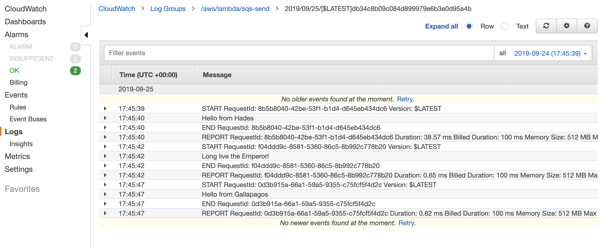
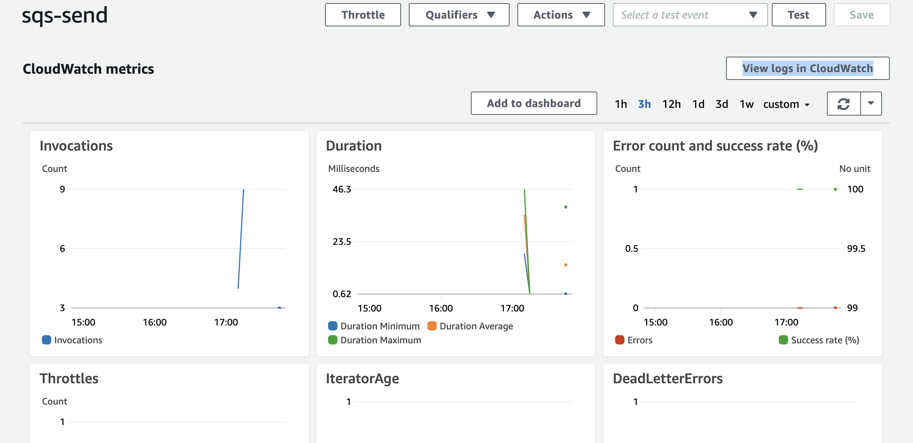

# Message Queues on AWS + SQS Trigger with a Lambda Queue
- Author: Travis Cox
- Challenge by: Codefellows.
<!-- Short summary or background information -->
- create 3 message queues on amazon's AWS service.
- create a SQS trigger, tied to lambda function.

## Special Consideration
Thanks to my paired programming partner Jack Kinne who worked through his code with me to complete this project. My laptop ate gradle somehow and is not loading, running, or cooperating in any meaningful way keeping me from completing these tasks without outside assistance. Thank you for your understanding.

## to implement
- clone and download repo
- configure your local AWS login by running ```aws configure``` and add your secret key and access key
- you can access your secret key, on the IAM console: [here](https://console.aws.amazon.com/iam/home?region=us-west-2#/home)
- confirm you are in the correct zone.
- run in your project directory ```./gradle build``` 
- this will create your zipped file in the build directory, in libs.
- upload your zipped file in an S3 bucket.
- Create a Lambda Trigger.
- Create a SQS Queue.  
- Tie the SQS Queue to the Lambda.

- to send a message, run the main within Send.java
- reciept of functions now happen automatically!  check your cloudwatch logs here:[cloudwatch](https://us-west-2.console.aws.amazon.com/cloudwatch/home?region=us-west-2#logs:)

## Challenge
<!-- Description of the challenge -->

- Create a Lambda function for your code.
- stretch goal: make it in Java!

- Create 3 Standard Queues
-  QueueA
-  QueueB
-  QueueC
-  Create command line applications in Java that use these queues
-  Queue Publisher
-  Sends a message to a queue, using its ARN or URL
-  Queue Client
-  Receives messages from a Queue (by ARN) and displays them
-  Food for thought …
-  Which library will you choose to connect to the SQS system?
-  How can you librarize your own solution so as not to be esoteric to a single application?
  
## Screenshots



## credits and contributions
- Ginger the dog
- @Bomibear
- Sapana Poudel
- Nhu Trinh
- Joachen Busch
- Brandon Hurrington
- Renee Messick
- Jack Kinne
- Jack Kinne
- Marisha Hoza
- Chris Coulon
- Matt Stuhring
- Nick Paro
- Melfi Perez
- Padmapriva Ganapathi
- https://docs.aws.amazon.com/sdk-for-java/v1/developer-guide/examples-sqs-message-queues.html
- https://docs.aws.amazon.com/lambda/latest/dg/with-sqs-create-package.html